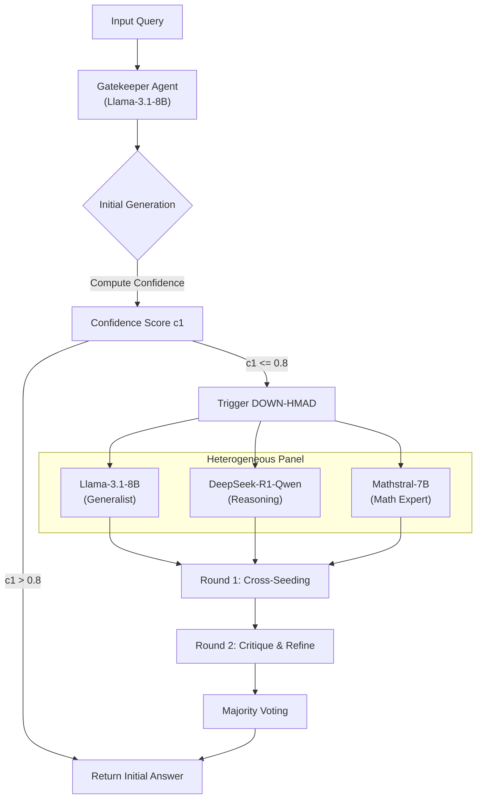

# Building Efficient Heterogeneous Multi-Agent Debate Frameworks

[](https://www.python.org/downloads/)
[](https://opensource.org/licenses/MIT)
[](https://pytorch.org/)

> **University of Michigan — EECS 498: Machine Learning Research Experience**  
> **Group 13 Capstone Project**
>
> This repository contains our work for the ML Research Experience capstone. The project consists of two phases:
> 1.  **Replication:** A reproduction of the findings from *Improving Factuality and Reasoning in Language Models through Multiagent Debate* (Du et al., 2023).
> 2.  **Extension:** A novel method proposing **DOWN-HMAD** (Debate Only When Necessary - Heterogeneous Multi-Agent Debate) to optimize the trade-off between reasoning accuracy and computational cost.

---

## 📖 Abstract

Large Language Models (LLMs) frequently suffer from hallucinations and "post-hoc rationalization" during complex reasoning tasks. While **Multi-Agent Debate (MAD)** has been shown to improve factuality, it introduces massive computational overhead (~15x FLOPs) and suffers from "echo chamber" effects when using homogeneous agents.

This project implements **DOWN-HMAD**, a novel framework that improves efficiency and reasoning diversity by:
1.  **Gating:** Utilizing a "gatekeeper" model to assess token confidence, triggering expensive debate *only* when necessary.
2.  **Heterogeneity:** Replacing identical agents with a diverse panel of specialized models (Generalist, Math Specialist, Reasoning Specialist) to mitigate correlated errors.

**Key Results:**
*   **40% reduction** in total compute (FLOPs) on knowledge retrieval tasks.
*   **18% accuracy improvement** on Biography generation compared to single-agent baselines.
*   **Discovery of "Syntactic Determinism":** Identified a critical failure mode in GSM8K where models report high confidence on incorrect answers due to correct formatting (e.g., `####` tokens), fooling the gating mechanism.

---

## 🏗 Architecture & DOWN-HMAD Protocol

### The Pipeline
The system utilizes a confidence-driven pipeline. If the Gatekeeper's confidence ($c_1$) exceeds a threshold $\theta$ (default 0.8), the debate is bypassed to save compute.



### Modular Codebase Design
The system is built on a strict **Factory Pattern** to allow seamless swapping between API-based and Local LLMs.

*   **`llm/core/`**: Defines the abstract `LLM` base class and `LLMConfig` dataclasses.
*   **`llm/implementations/`**:
    *   `local_llm.py`: Handles HuggingFace/vLLM loading, quantization, and local inference.
    *   `api_llm.py`: Interface for OpenAI/Anthropic APIs.
*   **`llm/factory.py`**: Instantiates the correct model class based on JSON configuration files.

---

## 📂 Repository Structure

The repository is organized to separate core framework logic from specific experimental setups.

```text
llm_multi_agent/
├── llm/                            # CORE FRAMEWORK
│   ├── core/                       # Abstract Base Classes & Configs
│   ├── implementations/            # Local (HF) & API (OpenAI) Wrappers
│   ├── configs/                    # Model parameters (DeepSeek, Llama, etc.)
│   └── factory.py                  # Model Instantiation Factory
│
├── extension/                      # DOWN-HMAD EXPERIMENTS (The Extension)
│   ├── biography/                  # Bio Generation with Confidence Gating
│   ├── gsm/                        # Math Reasoning with Confidence Gating
│   ├── mmlu/                       # MMLU Benchmark with Confidence Gating
│   └── run_all_extensions.sh       # HPC Job Submission Script
│
├── replication/                    # ORIGINAL PAPER REPLICATION (Baselines)
│   ├── gpt-3.5-turbo-replication/  # API-based Replication
│   └── open-source-replication/    # Llama-3.1-8B Replication
│
└── requirements.txt                # Project Dependencies
```

---

## 🚀 Installation & Setup

### Prerequisites
*   Python 3.10+
*   CUDA-enabled GPU (Required for `LocalLLM` / Open Source models)
*   High RAM (>32GB recommended for loading 8B+ models)

### Quick Start
```bash
# 1. Clone the repository
git clone https://github.com/Wenjia-Lu/llm_multi_agent.git
cd llm_multi_agent

# 2. Create Virtual Environment
python -m venv venv
source venv/bin/activate

# 3. Install Dependencies
pip install -r requirements.txt
```

---

## 💻 Usage

### 1. Running DOWN-HMAD (Extension)
The extension uses the heterogeneous panel and confidence gating. You must specify the `confidence_threshold` (default 0.8).

**Biography Generation:**
```bash
cd extension/biography
# Generate responses using DOWN-HMAD
# --agents 3 indicates usage of the heterogeneous panel
python gen_OS.py --rounds 3 --confidence_threshold 0.8 --agents 3

# Evaluate accuracy and hallucinations
python eval_OS.py --agents 3 --rounds 3 <generated_output_file.json>
```

**Grade School Math (GSM8K):**
```bash
cd extension/gsm
python gen_OS.py --rounds 3 --confidence_threshold 0.8
```

### 2. Running Replication (Baselines)
To replicate the original Du et al. paper results without confidence gating or heterogeneity.

**Open Source Baseline (Llama-3.1):**
```bash
cd replication/open-source-replication/mmlu
python gen_OS.py
```

**GPT-3.5 Baseline (API):**
```bash
cd replication/gpt-3.5-turbo-replication/math
# Requires OPENAI_API_KEY env var
python gen_math.py
```

---

## 📊 Results & Analysis

### Performance Summary

| Task | Method | Accuracy | FLOPs (Compute Cost) |
| :--- | :--- | :--- | :--- |
| **Biography** | Single Agent | 55% | 1.30e14 |
| | **DOWN-HMAD** | **73%** | **4.49e14** |
| | Standard MAD | 54% | 2.01e15 |
| **GSM8K** | Single Agent | 76% | 1.44e14 |
| | **DOWN-HMAD** | 30%* | 2.74e14 |

### Critical Analysis
*   **Efficiency:** DOWN-HMAD achieved a **12x compute reduction** on "easy" queries by successfully routing them to the single agent, while correctly elevating "hard" queries to the debate panel.
*   **The "Syntactic Determinism" Failure:** In GSM8K, the system failed to trigger debate (leading to 30% accuracy). Analysis revealed that models assigned 100% confidence to tokens like `$` and `=` even when the arithmetic was wrong. The gatekeeper was fooled by correct syntax, creating a false negative for the debate trigger.

---

## 👥 Contributors

**Group 13** - University of Michigan

*   **Ethan Justice** - Extension implementation, generalized LLM wrapper.
*   **Satyak Khare** - vLLM refactoring, HPC deployment, Replication codebase.
*   **Wenjia Lu** - Replication codebase, benchmark evaluations.
*   **Daniel Vega** - Data visualization, Methodology, plotting.
*   **Eli Wiegman** - Original paper selection, visualization, setup.
*   **Christopher Zhou** - Project management, roadmap strategy.

## 📚 References
1.  Du, Y. et al. (2023). *Improving Factuality and Reasoning in Language Models through Multiagent Debate*.
2.  Eo, S. et al. (2025). *Debate Only When Necessary (DOWN)*.
3.  Ye, R. et al. (2025). *X-MAS: Heterogeneous LLM-driven MAS*.